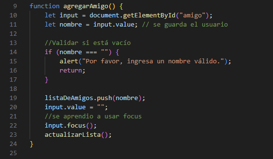
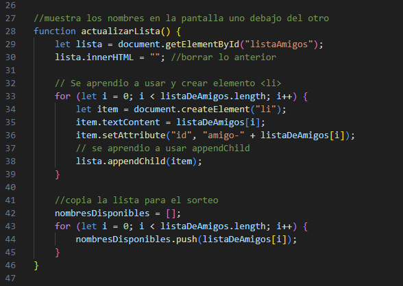
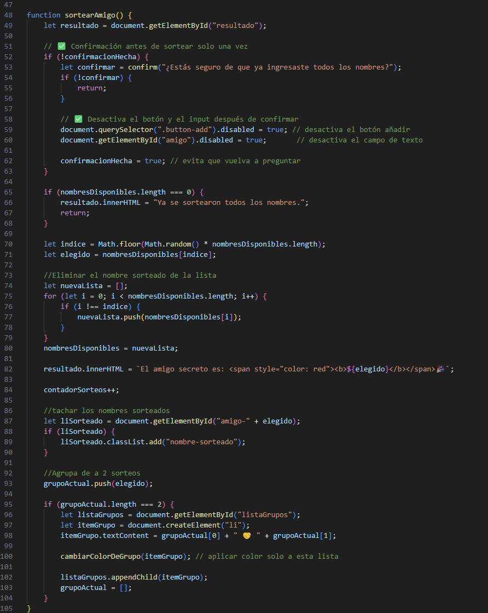
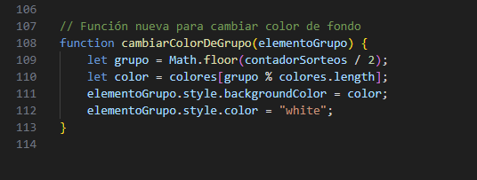

# Challenge Amigo Secreto 

 

Este proyecto es una pequeña aplicación web para **sortear amigos secretos**. Fue creado como práctica de programación utilizando **HTML y JavaScript**.

Es ideal para organizar juegos de amigo secreto o simplemente practicar lógica básica y manipulación del DOM en JavaScript.

---

## Indice de Contenido

- [Funcionalidad](#funcionalidad)
- [Aprendizajes](#aprendizajes)
- [Explicacion del Codigo](#explicacion-del-codigo)
- [Como usar](#como-usar)
- [Tecnologias usadas](#tecnologias-usadas)
- [Estructura de archivos](#estructura-de-archivos)
- [Autor](#autor)

---

## Funcionalidad

- Permite agregar nombres a una lista.
- Al presionar el botón de sorteo:
  - Se elige un nombre aleatoriamente.
  - Se muestra quién es el "amigo secreto".
  - Se agrupan los sorteos de dos en dos.
  - Se tachan los nombres que ya fueron sorteados.
  - Cada grupo se muestra con un color de fondo diferente.

#### [🔝 Volver al índice](#indice-de-contenido)

---

## Explicacion del Codigo

Esta sección describe la función de cada parte importante del archivo `app.js`:

### 🧮 Variables


- `listaDeAmigos`: Guarda los nombres que el usuario ingresa.
- `nombresDisponibles`: Copia de los amigos, se usa para ir sorteando sin repetir.
- `contadorSorteos`: Cuenta cuántas veces se ha sorteado.
- `grupoActual`: Guarda temporalmente dos nombres sorteados para formar un grupo.
- `colores`: Lista de colores usada para diferenciar visualmente los grupos.
- `confirmacionHecha`: Controla que la confirmación de nombres solo se haga una vez.

### ➕ `agregarAmigo()`



- Se ejecuta al hacer clic en "Añadir".
- Toma el valor del input y lo agrega a `listaDeAmigos`.
- Limpia el campo, lo enfoca nuevamente y actualiza la lista visual.
- También copia los nombres a `nombresDisponibles` para el sorteo.

### 🔄 `actualizarLista()`



- Muestra todos los nombres ingresados como elementos `<li>` en la lista.
- Asigna un `id` único a cada nombre (`amigo-nombre`) para poder tacharlo luego.
- También actualiza `nombresDisponibles` copiando nuevamente los nombres.

### 🎲 `sortearAmigo()`



- Antes de comenzar a sortear, pide al usuario confirmar si ya ingresó todos los nombres.
- Desactiva el botón y el input para evitar cambios después de iniciar el sorteo.
- Elige un nombre aleatorio de `nombresDisponibles` y lo muestra como "amigo secreto".
- Elimina ese nombre de la lista para no repetirlo.
- Tacha el nombre en la lista visual.
- Cada 2 sorteos, agrupa los nombres y los muestra como un par (grupo).
- Llama a `cambiarColorDeGrupo()` para darle un color diferente a cada grupo.

### 🎨 `cambiarColorDeGrupo(elementoGrupo)`



- Recibe un elemento de grupo y le asigna un color de fondo.
- Usa la cantidad de sorteos para elegir el color de forma cíclica.
- Mejora la visualización distinguiendo cada grupo con un color diferente.

#### [🔝 Volver al índice](#indice-de-contenido)

---

## Aprendizajes

Durante la creación de este proyecto, reforcé y descubrí varios conceptos fundamentales de **HTML y JavaScript**. A continuación, una lista de todo lo que aprendí:

### 📄 HTML

- Cómo estructurar una página correctamente usando etiquetas como `<ul>`, `<div>`, etc.
- Uso de `display: flex` en ```HTML``` para organizar elementos en filas o columnas de forma ordenada.
- Mejora en la organización visual separando listas (`<ul>`) y botones con márgenes.

### 💻 JavaScript

- Cómo obtener valores desde un campo `<input>` y **limpiar el campo** automáticamente.
- Uso de `focus()` para mejorar la experiencia del usuario, haciendo que el cursor regrese al campo de texto.
- Crear elementos HTML dinámicamente, como `<li>`, usando `document.createElement`.
- Insertar elementos en el DOM con `appendChild()`.
- Asignar `id` únicos a elementos creados dinámicamente.
- **Copiar un arreglo manualmente** usando un bucle `for` para entender mejor cómo funciona la asignación de valores.
- Implementar una **confirmación con `confirm()`** antes de ejecutar el sorteo.
- Desactivar elementos de la interfaz (`input` y `botón`) con `.disabled = true` para evitar errores del usuario.
- Remover un elemento de un array usando lógica básica con `if`.
- Aplicar clases (`classList.add`) para modificar el estilo visual de elementos (tachar sorteados).
- Cambiar estilos directamente desde JavaScript, como el color de fondo, usando `style.backgroundColor`.

#### [🔝 Volver al índice](#indice-de-contenido)

---

## Como usar

1. Abre el proyecto de alguna de estas dos formas:
   - 📥 **Descargando los archivos** y abriendo `index.html` en tu navegador (doble clic o botón derecho → abrir con navegador).
   - 🌐 **[🚧Link en construcción🚧]** (futuro enlace con GitHub Pages).

2. Ingresa nombres uno por uno en el campo de texto y haz clic en **"Añadir"**.

3. Una vez agregados todos los nombres, haz clic en **"Sortear Amigo Secreto"**.

4. Verás en pantalla:
   - El nombre sorteado.
   - Los nombres tachados.
   - Los grupos formados con colores diferentes.

#### [🔝 Volver al índice](#indice-de-contenido)

---

## Tecnologias usadas

- HTML5
- JavaScript
- Git y Github
- Visual Studio Code

#### [🔝 Volver al índice](#indice-de-contenido)

---

## Estructura de archivos

```
challenge-amigo-secreto/
│
├── index.html         # Estructura del sitio
├── style.css          # Estilos visuales
├── app.js             # Lógica del sorteo
└── README.md          # Documentación del proyecto
```

#### [🔝 Volver al índice](#indice-de-contenido)

---

## Autor
**Paul Stuart Ruiz Cabrera** 

 [](https://github.com/Paulruiz23) [](https://www.linkedin.com/in/paulruiz4227/)

 #### [🔝 Volver al índice](#indice-de-contenido)