# Challenge Amigo Secreto 

 


Este proyecto es una pequeña aplicación web para **sortear amigos secretos**. Fue creado como práctica de programación utilizando **HTML, CSS y JavaScript**.

Es ideal para organizar juegos de amigo secreto a nivel usuario o simplemente practicar lógica básica y manipulación del DOM en JavaScript si eres programador.

---


## Indice de Contenido

- [Funcionalidad](#funcionalidad)
- [Explicacion del Código](#explicacion-del-codigo)
- [Desafios durante el desarrollo](#desafios-durante-el-desarrollo)
- [Aprendizajes](#aprendizajes)
- [Como usar](#como-usar)
- [Tecnologias usadas](#tecnologias-usadas)
- [Estructura de archivos](#estructura-de-archivos)
- [Autor](#autor)

---

## Funcionamiento

- Permite agregar nombres a una lista.

   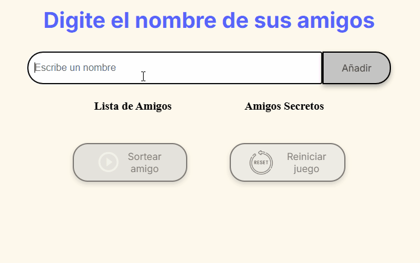

- Al presionar el botón de sorteo:
   - Se elige un nombre aleatoriamente.
   - Se muestra quién es el "amigo secreto".
   - Se agrupan los sorteos de dos en dos.
   - Se tachan los nombres que ya fueron sorteados.
   - Cada grupo se muestra con un color de fondo diferente.

   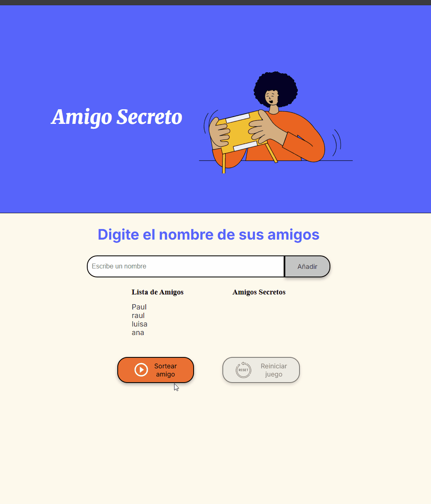

- Al presionar el boton de reinicio:
   - Limpia listas y variables.
   - Borra la pantalla.
   - Habilita el campo de texto.
   - Desactiva botones de sorteo y reinicio.
   - Coloca el cursor en el campo.

   

#### [🔝 Volver al indice](#indice-de-contenido)

---

## Explicacion del Codigo

Esta sección describe la función de cada parte importante del archivo `app.js`:

### 🧮 Variables

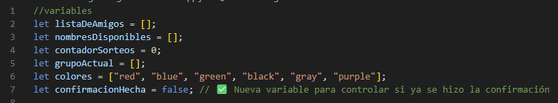

- `listaDeAmigos`: Guarda los nombres que el usuario ingresa.
- `nombresDisponibles`: Copia de los amigos, se usa para ir sorteando sin repetir.
- `contadorSorteos`: Cuenta cuántas veces se ha sorteado.
- `grupoActual`: Guarda temporalmente dos nombres sorteados para formar un grupo.
- `confirmacionHecha`: Controla que la confirmación de nombres solo se haga una vez.

---

### ➕ `agregarAmigo()`

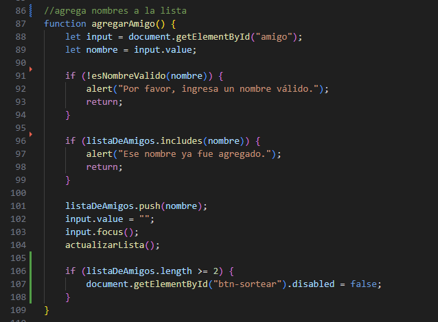

- Se ejecuta al hacer clic en "Añadir".
- Toma el valor del input y lo agrega a `listaDeAmigos`.
- Limpia el campo, lo enfoca nuevamente y actualiza la lista visual.
- También copia los nombres a `nombresDisponibles` para el sorteo.

---

### 🔄 `actualizarLista()`

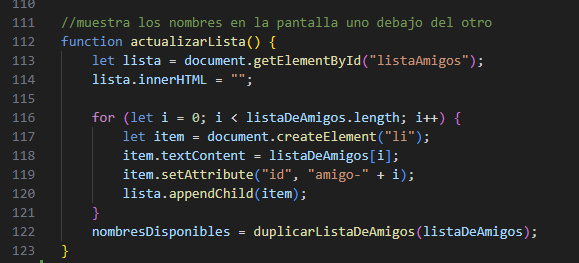

- Muestra todos los nombres ingresados como elementos `<li>` en la lista.
- Asigna un `id` único a cada nombre (`amigo-n`) para poder tacharlo luego.
- También actualiza `nombresDisponibles` copiando nuevamente los nombres.

---

### 🎲 `sortearAmigo()`

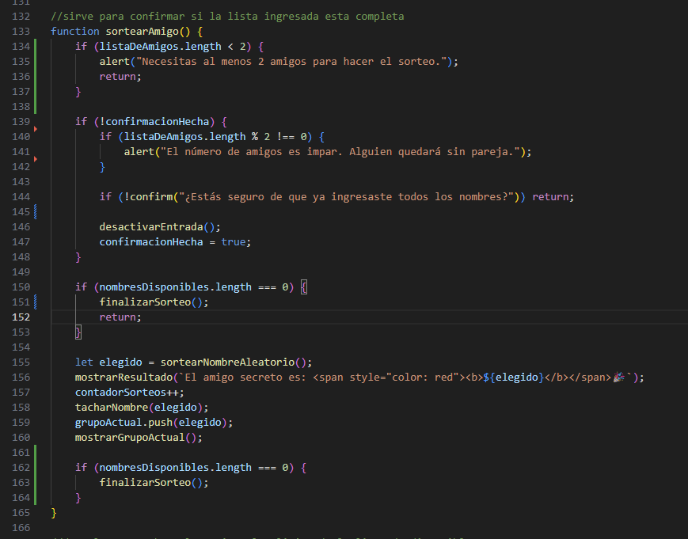

- Antes de comenzar a sortear, pide al usuario confirmar si ya ingresó todos los nombres.
- Desactiva el botón y el input para evitar cambios después de iniciar el sorteo.
- Elige un nombre aleatorio de `nombresDisponibles` y lo muestra como "amigo secreto".
- Elimina ese nombre de la lista para no repetirlo.
- Tacha el nombre en la lista visual.
- Cada 2 sorteos, agrupa los nombres y los muestra como un par (grupo).

---

### ✅ `reiniciarJuego()`

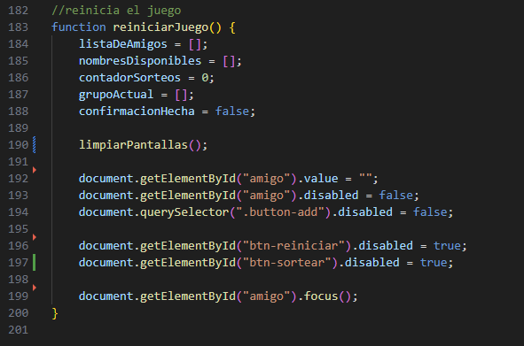

- Restaura todas las variables al estado inicial.
- Habilita nuevamente los botones y el input.
- Limpia las secciones visuales: nombres, grupos y resultado.
- Llama a `limpiarPantallas()` para realizar esta limpieza.

---

### 🧽 `limpiarPantallas()`

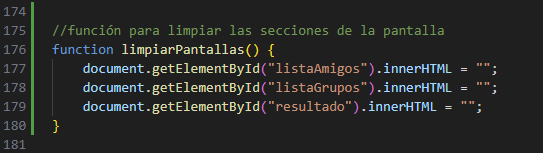

- Borra el contenido de las tres secciones principales:
  - `#listaAmigos`
  - `#listaGrupos`
  - `#resultado`
- Se usa principalmente al reiniciar el juego.

---

### ✅ `finalizarSorteo()`

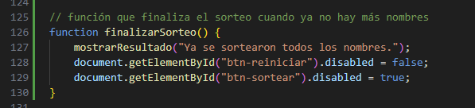

- Se llama cuando ya no quedan más nombres por sortear.
- Muestra un mensaje final y activa el botón de reinicio.

---

### 📝 Funciones auxiliares

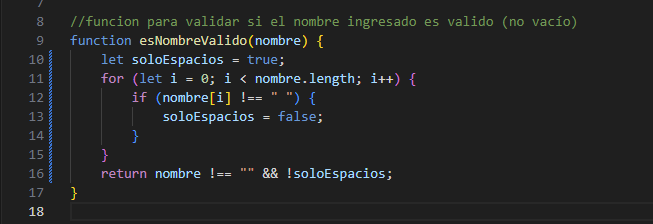

   `esNombreValido(nombre)`: Verifica que el campo no esté vacío.

---
  
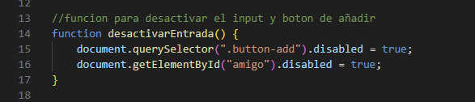

   `desactivarEntrada()`: Desactiva el botón de añadir y el input de texto.

---


   `mostrarResultado(mensaje)`: Muestra un mensaje en el área de resultado.

---

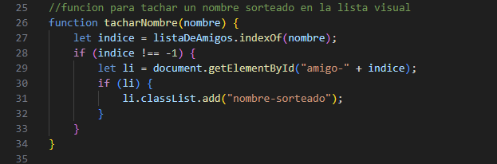

   `tacharNombre(nombre)`: Aplica una clase al nombre sorteado para marcarlo visualmente.

---

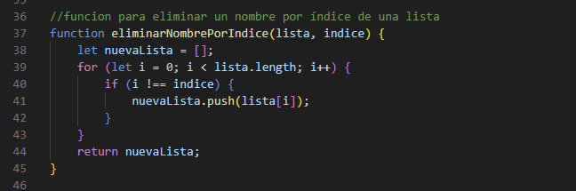

   `eliminarNombrePorIndice(lista, indice)`: Elimina un nombre específico de una lista.

---

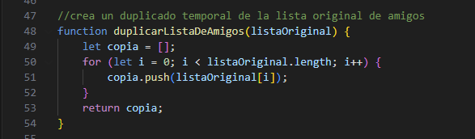

   `duplicarListaDeAmigos(lista)`: Crea una copia exacta de la lista original.

---

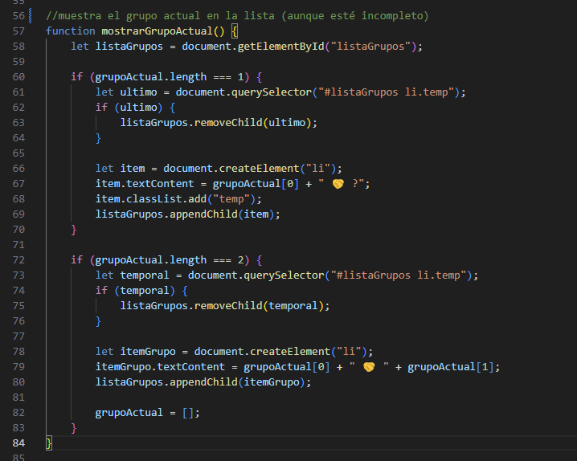

   `mostrarGrupoActual()`: Muestra en pantalla los grupos que se van formando.

---

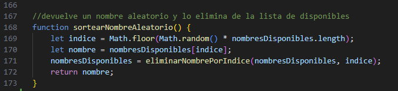

   `sortearNombreAleatorio()`: Selecciona un nombre al azar de los disponibles y lo elimina.


#### [🔝 Volver al indice](#indice-de-contenido)

---


## Desafios durante el desarrollo

Durante la creación del proyecto **Challenge Amigo Secreto**, enfrenté varios obstáculos que me ayudaron a mejorar mis habilidades en HTML, CSS y JavaScript. Aquí detallo los principales retos y cómo los solucioné:

1. **Control de duplicados en el sorteo**  
   - **Problema:** No existía una lógica clara que impidiera que una persona se sorteara a sí misma.  
   - **Solución:** Implementé una validación en JavaScript que asegura que el nombre asignado no sea igual al actual antes de confirmar el sorteo.

2. **Separación visual entre listas**  
   - **Problema:** La interfaz no mostraba claramente la separación entre la lista de amigos y los sorteos realizados.  
   - **Solución:** Utilicé `flexbox` y agregué la clase `.listas-container` para alinear visualmente ambas secciones de forma clara.

3. **Hacer el botón de reinicio dinámico**  
   - **Problema:** El botón de reiniciar aparecía todo el tiempo, incluso cuando no era necesario.  
   - **Solución:** Agregué una condición en JavaScript para que el botón solo se active después de un sorteo, y apliqué un color verde para indicar que está disponible.

4. **Separación del código JavaScript en funciones**  
   - **Problema:** La mayor parte del código en  `app.js` se encontraba en un solo bloque.  
   - **Solución:** Identifiqué que se podia dividir el código en funciones pequeñas con nombres descriptivos (por ejemplo: `validarNombre()`, `actualizarLista()`, `mostrarGrupo()`), esto facilitaría la lectura y el mantenimiento.

5. **Boton activo al terminar el sorteo**
   - **Problema:** El botón **Sortear amigo** seguía activo incluso después de completar todos los sorteos. Esto permitía al usuario seguir presionándolo, mostrando repetidamente el mensaje "Ya se sortearon todos los nombres.".
   - **Solución:** Se implementó una condición al final de la función `sortearAmigo()` en el archivo `app.js` que verifica si ya no hay más nombres disponibles. Si es así, el botón se desactiva automáticamente para evitar más clics.

6. **Problemas al hacer commits con Git**  
   - **Problema:** Al intentar hacer `commit`, apareció un error por la existencia de un archivo `.COMMIT_EDITMSG.swp`, lo cual bloqueaba el proceso y causaba confusión.  
   - **Solución:** Identifiqué que se trataba de un archivo temporal creado por el editor. Lo eliminé desde la terminal, lo que resolvió el conflicto. Además, aprendí a usar comandos como `git status`, `git add` y `git commit` individualmente para tener mejor control del repositorio.

7. **Organización del `README.md` y navegación entre secciones**  
   - **Problema:** A medida que el contenido del `README.md` crecía, se volvió difícil de navegar y localizar información rápidamente. La falta de estructura clara dificultaba la lectura y comprensión del proyecto.  
   - **Solución:** Implementé un indice al inicio del documento con enlaces internos (`anclas`) que permiten saltar directamente a cada sección. Además, añadí una `ancla` de retorno al indice al final de cada sección principal para facilitar la navegación hacia el inicio del documento.
.

8. **Índice de navegación dañado por íconos en títulos del `README.md`**  
   - **Problema:** Los enlaces del indice no funcionaban correctamente por los emojis en los títulos.  
   - **Solución:** Eliminé los íconos y mantuve solo texto en los encabezados para asegurar que el indice automático de GitHub funcionara como se esperaba.

9. **Insertar imágenes y GIFs en el `README.md`**  
   - **Problema:** No estaba seguro de si Markdown permitía incluir imágenes `.png` o animaciones `.gif`.  
   - **Solución:** Confirmé que se pueden incluir con la sintaxis 
   
       ``.


> Estos retos me ayudaron a practicar, comprender mejor la estructura del DOM, mejorar el uso de Git y reforzar conceptos de diseño web.

#### [🔝 Volver al indice](#indice-de-contenido)

---

## Aprendizajes

Durante la creación de este proyecto, reforcé y descubrí varios conceptos fundamentales de **HTML y JavaScript**. A continuación, una lista de todo lo que aprendí:

### 📄 HTML
- Se aprendió a asignar un `id` a un botón en HTML para poder manipularlo desde JavaScript.
- Cómo estructurar una página correctamente usando etiquetas como `<ul>`, `<div>`, etc.
- Uso de `display: flex` en ```HTML``` para organizar elementos en filas o columnas de forma ordenada.
- Mejora en la organización visual separando listas (`<ul>`) y botones con márgenes.

### 💻 JavaScript

- Cómo obtener valores desde un campo `<input>` y limpiar el campo automáticamente.
- Uso de `focus()` para mejorar la experiencia del usuario, haciendo que el cursor regrese al campo de texto.
- Crear elementos HTML dinámicamente, como `<li>`, usando `document.createElement`.
- Insertar elementos en el DOM con `appendChild()`.
- Asignar `id` únicos a elementos creados dinámicamente.
- Copiar un arreglo manualmente usando un bucle `for` para entender mejor cómo funciona la asignación de valores.
- Implementar una confirmación con `confirm()` antes de ejecutar el sorteo.
- Desactivar elementos de la interfaz (`input` y `botón`) con `.disabled = true` para evitar errores del usuario.
- Remover un elemento de un array usando lógica básica con `if`.
- Aplicar clases (`classList.add`) para modificar el estilo visual de elementos (tachar sorteados).
- Cambiar estilos directamente desde JavaScript, como el color de fondo, usando `style.backgroundColor`.
- Se utilizó `document.getElementById("btn-sortear").disabled = true`; para deshabilitar dinámicamente el botón una vez finalizado el proceso del sorteo.

### 🎨 CSS

- Aprendí a usar `display: flex` con propiedades como `justify-content` y `gap` para alinear listas y botones horizontalmente y darles espacio sin necesidad de márgenes individuales.
- Apliqué reglas como `margin-top` y `margin-bottom` para separar visualmente los bloques.
- Usé la pseudoclase `:disabled` para que los botones se vean atenuados cuando no están disponibles, mejorando la experiencia del usuario.
- Usé clases como `.listas-container` para organizar el contenido y mantener una estructura visual coherente entre secciones.
- Aprendi a no usar efectos visuales innecesarios (como cambio de color al sortear) para simplificar el diseño y enfocarme en la funcionalidad.


### 🔧 Git

- Aprendí a hacer commit individuales por archivo para mantener un historial limpio y claro de cambios. Por ejemplo: `git add ruta/del/archivo` y luego 
`git commit -m "Descripción del cambio realizado"`.
- Usé `git status` para ver qué archivos fueron modificados antes de confirmar cambios.
- Comprendí cómo resolver errores causados por archivos `.swp`, eliminándolos directamente con: `rm .nombre-del-archivo.swp`
- Practiqué cómo navegar entre carpetas y usar comandos como cd para moverme en la terminal al directorio correcto del proyecto.
- Aprendí a no realizar commits accidentales, verificando cuidadosamente el estado de los archivos antes de confirmar.


#### [🔝 Volver al indice](#indice-de-contenido)

---

## Como usar

1. Abre el proyecto de alguna de estas dos formas:
   - 📥 **Descargando los archivos** y abriendo `index.html` en tu navegador (doble clic o botón derecho → abrir con navegador).
   - 🌐 **[🚧Link en construcción🚧]** (futuro enlace con GitHub Pages).


2. Ingresa nombres uno por uno en el campo de texto y haz clic en **"Añadir"**.

3. Una vez agregados todos los nombres, haz clic en **"Sortear Amigo Secreto"**.

4. Verás en pantalla:
   - El nombre sorteado.
   - Los nombres tachados.
   - Los grupos formados con colores diferentes.

#### [🔝 Volver al indice](#indice-de-contenido)

---

## Tecnologias usadas

- HTML5
- CSS3
- JavaScript(ES6) 
- Git y Github
- Visual Studio Code

#### [🔝 Volver al indice](#indice-de-contenido)

---

## Estructura de archivos

```
2.challenge-amigosecreto/
│
├── index.html           # Estructura principal de la página
├── style.css            # Estilos visuales
├── app.js               # Lógica de JavaScript
├── README.md            # Documentación del proyecto
│
└── assets/              # Carpeta con recursos visuales

```
#### [🔝 Volver al indice](#indice-de-contenido)

---

## Autor
**Paul Stuart Ruiz Cabrera** 

 [](https://github.com/Paulruiz23) [](https://www.linkedin.com/in/paulruiz4227/)

 #### [🔝 Volver al indice](#indice-de-contenido)